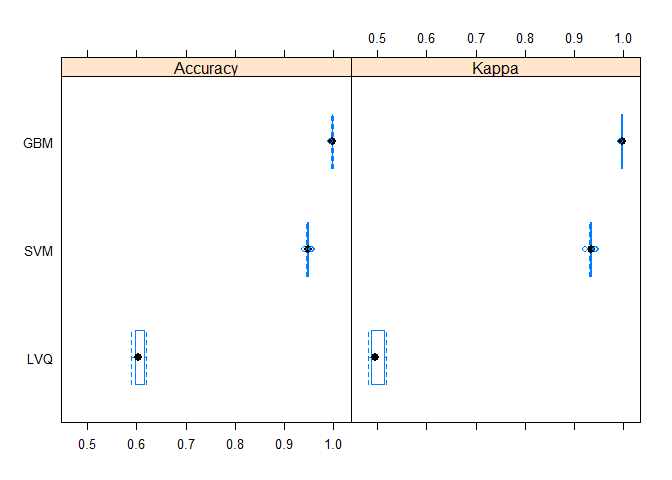
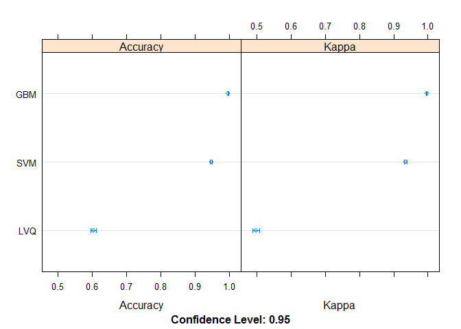

# Machine Learning
Joao Paulo de Oliveira Pereira  
04 de setembro de 2017  


## Machine Learning Course Project

In this project three different machine leanring methods will be compared in order to determine which is the best one to predict the values wanted.

The *Learning Vector Quantization (LVQ)*, *Gradient Boosted Machine (GBM)* and *Support Vector Machine (SVM)* were selected to this exercice

Here the working directory is setted and the data files are downloaded.

```r
setwd("D:/Data Science/Curso R/8. Machine Learning/course project")

download.file("https://d396qusza40orc.cloudfront.net/predmachlearn/pml-training.csv", destfile = "pml-training.csv")
download.file("https://d396qusza40orc.cloudfront.net/predmachlearn/pml-testing.csv", destfile = "pml-testing.csv")
```

The exercice will be done using the *caret* package. In this part of the code the package is called and the datasets are created in the global environment. 

Examining the datasets it is noted that many columns (variables) have mainly NAs (missing values). These variables were removed from the datasets.

```r
require(caret)
require(dplyr)
training <- read.csv("pml-training.csv")
testing <- read.csv("pml-testing.csv")
```

The varibles with missing values in the training data are listed below. The proportion of missing values in these variables is approximately 98% for all the variables with missing values (NAs).
The training data presents many variables with missing values. All columns with NAs have only NAs in its fields, so this variables will not be used to fit the models.

```r
data.frame(Vars = names(training), Prop.NA = sort(sapply(training, function(x) sum(is.na(x)) / length(x)), decreasing = TRUE)) %>% filter(Prop.NA > 0)
```

```
##                    Vars   Prop.NA
## 1                     X 0.9793089
## 2             user_name 0.9793089
## 3  raw_timestamp_part_1 0.9793089
## 4  raw_timestamp_part_2 0.9793089
## 5        cvtd_timestamp 0.9793089
## 6            new_window 0.9793089
## 7            num_window 0.9793089
## 8             roll_belt 0.9793089
## 9            pitch_belt 0.9793089
## 10             yaw_belt 0.9793089
## 11     total_accel_belt 0.9793089
## 12   kurtosis_roll_belt 0.9793089
## 13  kurtosis_picth_belt 0.9793089
## 14    kurtosis_yaw_belt 0.9793089
## 15   skewness_roll_belt 0.9793089
## 16 skewness_roll_belt.1 0.9793089
## 17    skewness_yaw_belt 0.9793089
## 18        max_roll_belt 0.9793089
## 19       max_picth_belt 0.9793089
## 20         max_yaw_belt 0.9793089
## 21        min_roll_belt 0.9793089
## 22       min_pitch_belt 0.9793089
## 23         min_yaw_belt 0.9793089
## 24  amplitude_roll_belt 0.9793089
## 25 amplitude_pitch_belt 0.9793089
## 26   amplitude_yaw_belt 0.9793089
## 27 var_total_accel_belt 0.9793089
## 28        avg_roll_belt 0.9793089
## 29     stddev_roll_belt 0.9793089
## 30        var_roll_belt 0.9793089
## 31       avg_pitch_belt 0.9793089
## 32    stddev_pitch_belt 0.9793089
## 33       var_pitch_belt 0.9793089
## 34         avg_yaw_belt 0.9793089
## 35      stddev_yaw_belt 0.9793089
## 36         var_yaw_belt 0.9793089
## 37         gyros_belt_x 0.9793089
## 38         gyros_belt_y 0.9793089
## 39         gyros_belt_z 0.9793089
## 40         accel_belt_x 0.9793089
## 41         accel_belt_y 0.9793089
## 42         accel_belt_z 0.9793089
## 43        magnet_belt_x 0.9793089
## 44        magnet_belt_y 0.9793089
## 45        magnet_belt_z 0.9793089
## 46             roll_arm 0.9793089
## 47            pitch_arm 0.9793089
## 48              yaw_arm 0.9793089
## 49      total_accel_arm 0.9793089
## 50        var_accel_arm 0.9793089
## 51         avg_roll_arm 0.9793089
## 52      stddev_roll_arm 0.9793089
## 53         var_roll_arm 0.9793089
## 54        avg_pitch_arm 0.9793089
## 55     stddev_pitch_arm 0.9793089
## 56        var_pitch_arm 0.9793089
## 57          avg_yaw_arm 0.9793089
## 58       stddev_yaw_arm 0.9793089
## 59          var_yaw_arm 0.9793089
## 60          gyros_arm_x 0.9793089
## 61          gyros_arm_y 0.9793089
## 62          gyros_arm_z 0.9793089
## 63          accel_arm_x 0.9793089
## 64          accel_arm_y 0.9793089
## 65          accel_arm_z 0.9793089
## 66         magnet_arm_x 0.9793089
## 67         magnet_arm_y 0.9793089
```

```r
data.frame(Vars = names(testing), Prop.NA = sort(sapply(testing, function(x) sum(is.na(x)) / length(x)), decreasing = TRUE)) %>% filter(Prop.NA > 0)
```

```
##                         Vars Prop.NA
## 1                          X       1
## 2                  user_name       1
## 3       raw_timestamp_part_1       1
## 4       raw_timestamp_part_2       1
## 5             cvtd_timestamp       1
## 6                 new_window       1
## 7                 num_window       1
## 8                  roll_belt       1
## 9                 pitch_belt       1
## 10                  yaw_belt       1
## 11          total_accel_belt       1
## 12        kurtosis_roll_belt       1
## 13       kurtosis_picth_belt       1
## 14         kurtosis_yaw_belt       1
## 15        skewness_roll_belt       1
## 16      skewness_roll_belt.1       1
## 17         skewness_yaw_belt       1
## 18             max_roll_belt       1
## 19            max_picth_belt       1
## 20              max_yaw_belt       1
## 21             min_roll_belt       1
## 22            min_pitch_belt       1
## 23              min_yaw_belt       1
## 24       amplitude_roll_belt       1
## 25      amplitude_pitch_belt       1
## 26        amplitude_yaw_belt       1
## 27      var_total_accel_belt       1
## 28             avg_roll_belt       1
## 29          stddev_roll_belt       1
## 30             var_roll_belt       1
## 31            avg_pitch_belt       1
## 32         stddev_pitch_belt       1
## 33            var_pitch_belt       1
## 34              avg_yaw_belt       1
## 35           stddev_yaw_belt       1
## 36              var_yaw_belt       1
## 37              gyros_belt_x       1
## 38              gyros_belt_y       1
## 39              gyros_belt_z       1
## 40              accel_belt_x       1
## 41              accel_belt_y       1
## 42              accel_belt_z       1
## 43             magnet_belt_x       1
## 44             magnet_belt_y       1
## 45             magnet_belt_z       1
## 46                  roll_arm       1
## 47                 pitch_arm       1
## 48                   yaw_arm       1
## 49           total_accel_arm       1
## 50             var_accel_arm       1
## 51              avg_roll_arm       1
## 52           stddev_roll_arm       1
## 53              var_roll_arm       1
## 54             avg_pitch_arm       1
## 55          stddev_pitch_arm       1
## 56             var_pitch_arm       1
## 57               avg_yaw_arm       1
## 58            stddev_yaw_arm       1
## 59               var_yaw_arm       1
## 60               gyros_arm_x       1
## 61               gyros_arm_y       1
## 62               gyros_arm_z       1
## 63               accel_arm_x       1
## 64               accel_arm_y       1
## 65               accel_arm_z       1
## 66              magnet_arm_x       1
## 67              magnet_arm_y       1
## 68              magnet_arm_z       1
## 69         kurtosis_roll_arm       1
## 70        kurtosis_picth_arm       1
## 71          kurtosis_yaw_arm       1
## 72         skewness_roll_arm       1
## 73        skewness_pitch_arm       1
## 74          skewness_yaw_arm       1
## 75              max_roll_arm       1
## 76             max_picth_arm       1
## 77               max_yaw_arm       1
## 78              min_roll_arm       1
## 79             min_pitch_arm       1
## 80               min_yaw_arm       1
## 81        amplitude_roll_arm       1
## 82       amplitude_pitch_arm       1
## 83         amplitude_yaw_arm       1
## 84             roll_dumbbell       1
## 85            pitch_dumbbell       1
## 86              yaw_dumbbell       1
## 87    kurtosis_roll_dumbbell       1
## 88   kurtosis_picth_dumbbell       1
## 89     kurtosis_yaw_dumbbell       1
## 90    skewness_roll_dumbbell       1
## 91   skewness_pitch_dumbbell       1
## 92     skewness_yaw_dumbbell       1
## 93         max_roll_dumbbell       1
## 94        max_picth_dumbbell       1
## 95          max_yaw_dumbbell       1
## 96         min_roll_dumbbell       1
## 97        min_pitch_dumbbell       1
## 98          min_yaw_dumbbell       1
## 99   amplitude_roll_dumbbell       1
## 100 amplitude_pitch_dumbbell       1
```

The training data is then filtered to remove the columns with NAs in the testing set.

```r
variaveis <- testing[sapply(testing, function(x) sum(is.na(x))) == 0] %>% 
        names() %>%
        .[!(. %in% c("X", "user_name","problem_id"))]

training <- training[c(variaveis, "classe")]
```

Each of the three models are fitted in a k-fold cross-validation method with 10 folds. Models with cross-validation are less biased and helps prevent overfitting.

```r
require(doParallel)
        no_cores <- detectCores()-1
        cl <- makeCluster(no_cores)  
        registerDoParallel(cores=no_cores)

# Set the training options
control <- trainControl(method = "cv", number = 10, allowParallel = TRUE)

# Train the LVQ model
set.seed(280581)
modelLVQ <- train(classe ~ ., data = training[-c(1,2)], method = "lvq", trControl = control)

# Train the GBM model
set.seed(280581)
modelGBM <- train(classe ~ ., data = training, method = "gbm", trControl = control, verbose = FALSE)

# Train the SVM model
set.seed(280581)
modelSVM <- train(classe ~ ., data = training[-c(1,2)], method = "svmRadial", trControl = control)

stopCluster(cl)
```

After running the 3 models we collect the results and compare to find wich one performed better.


```r
# Collect resamples
results <- resamples(list(LVQ = modelLVQ, GBM = modelGBM, SVM = modelSVM))

# Summarize the distributions
summary(results)
```

```
## 
## Call:
## summary.resamples(object = results)
## 
## Models: LVQ, GBM, SVM 
## Number of resamples: 10 
## 
## Accuracy 
##       Min. 1st Qu. Median   Mean 3rd Qu.   Max. NA's
## LVQ 0.5897  0.5968 0.6038 0.6044  0.6138 0.6193    0
## GBM 0.9939  0.9966 0.9977 0.9971  0.9980 0.9985    0
## SVM 0.9393  0.9471 0.9478 0.9482  0.9485 0.9562    0
## 
## Kappa 
##       Min. 1st Qu. Median   Mean 3rd Qu.   Max. NA's
## LVQ 0.4822  0.4889 0.4963 0.4992  0.5117 0.5184    0
## GBM 0.9923  0.9956 0.9971 0.9964  0.9974 0.9981    0
## SVM 0.9232  0.9330 0.9338 0.9343  0.9348 0.9445    0
```

```r
# Boxplots of results
bwplot(results)
```

<!-- -->

```r
# Dot plots of results
dotplot(results)
```

<!-- -->

AS we can see in the tables and graphics above, the model with the best performance between the three of them is the GBM model. It will be, then, used to predict the values in the testing set.


```r
quiz <- data.frame(Question = 1:20, Answer = predict(modelGBM, testing))
```


